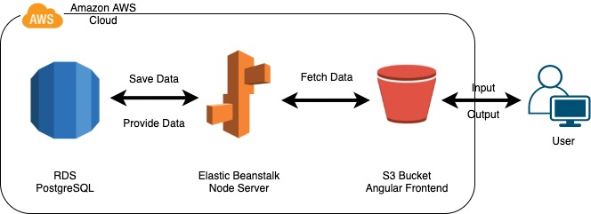
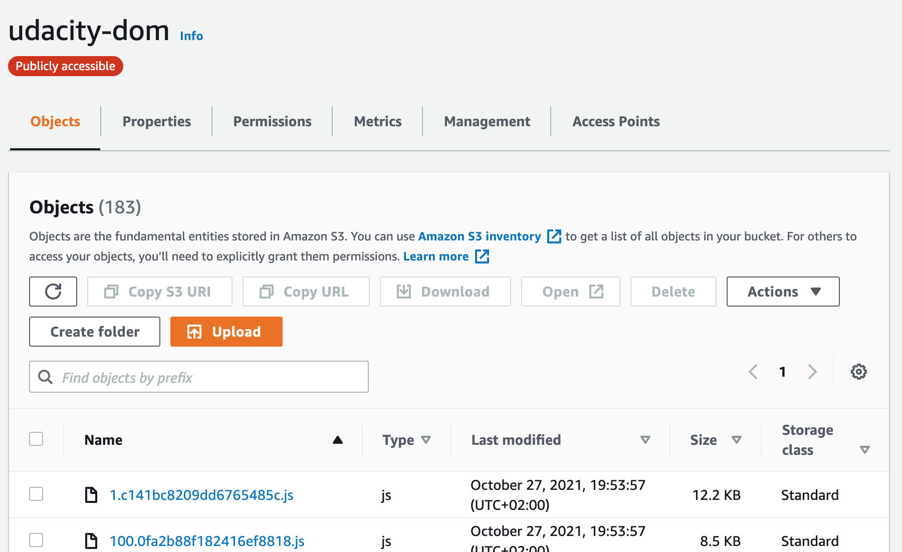
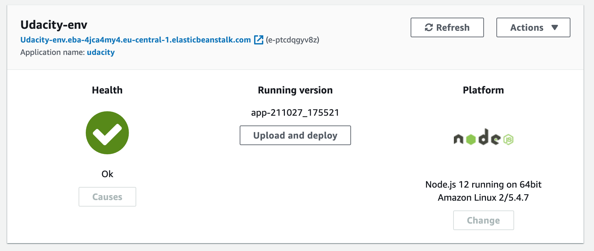
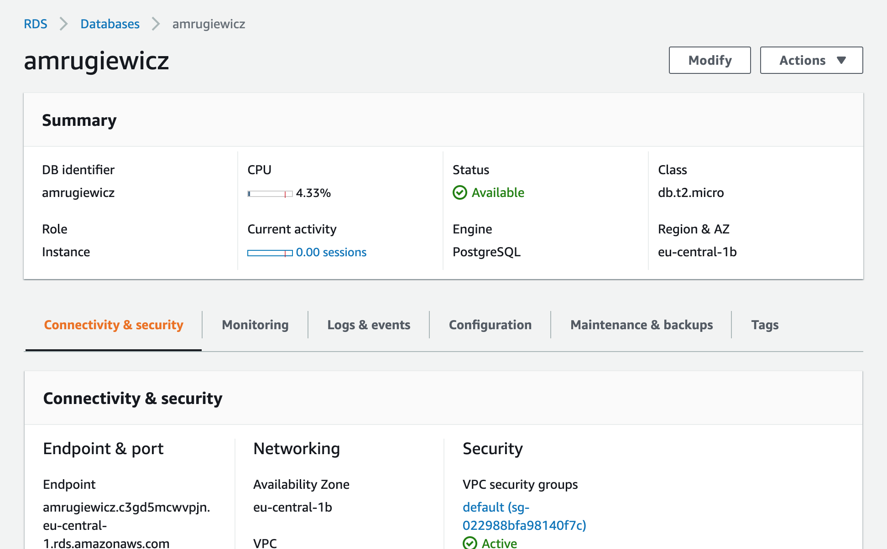
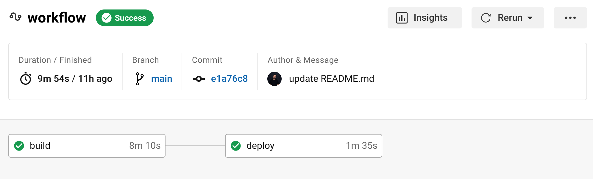
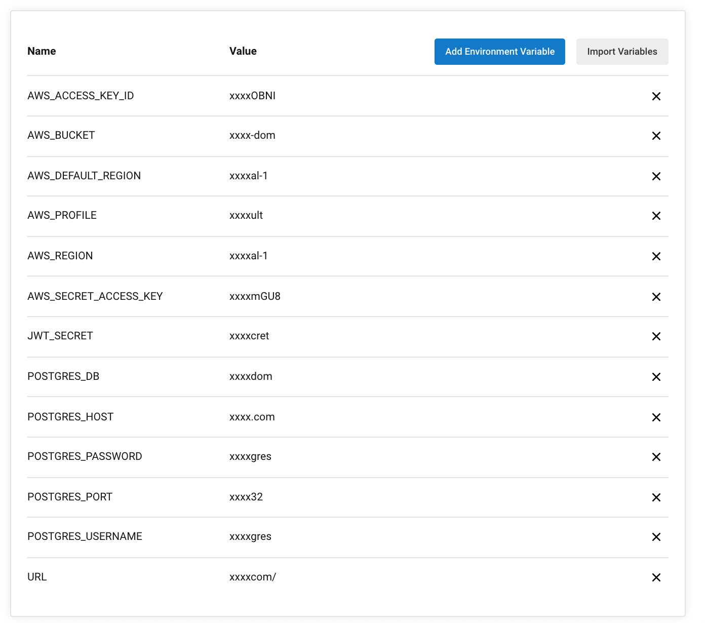

# Documentation

## Infrastructure

This application is hosted on three services of the AWS Cloud. It uses S3 Buckets as for file storage, an elastic beanstalk application as a server and RDS for data storage.
In the frontend the user can interact through an angular application.

### S3 Bucket

### Elastic Beanstalk

### RDS PostgreSQL

## Pipeline process

For the pipeline-process circleCi is used.

### CircleCi
When the user pushes a commit to the Git-Repository, the pipeline is triggered.
The pipeline process is structured in workflows, jobs and steps by the [config file](../.circleci/config.yml).
Through environment-variables, circleCi is allowed to fulfill the deployment process on the aws cloud services. 

#### Successfull Deployment

#### CircleCi Environment

## Dependencies
- Node
- Npm
- AWS CLI
- Elastic Beanstalk CLI
- Angular CLI

